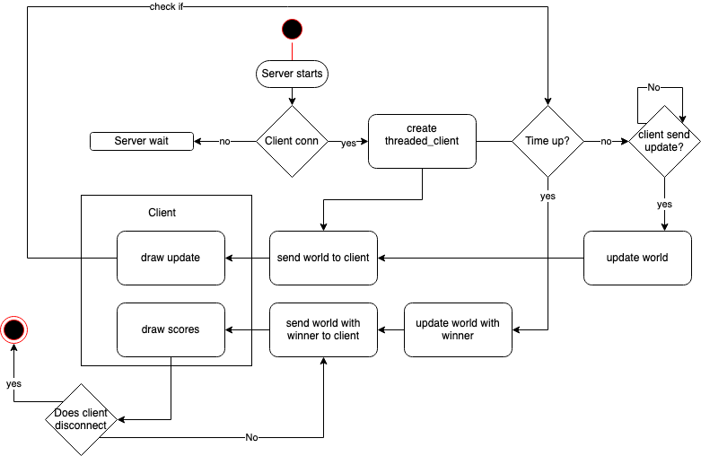

## Socket_based_game made with my friend Johanna Löv

We used tcod tutorial for the roguelike game available here. http://rogueliketutorials.com/tutorials/tcod/ as we focused on sockets in this project.

The class input handler is copied from the tutorial, the class entity is build upon the entity class from the tutorial. Our goal was to implement server client connections.

To run this oh-so-beautiful and professional game:
Clone the repo, and in the terminal:

1. Run *python3 game.py*
It should print *Waiting for connection, server started*.

2. Run *python3 client.py*
The client should appear as a B on the screen. The goal is to pick up all the colored @ signs. You can connect as many clients as you like.

At least two players must be connected and play to have a winner (she/he who collects the most arrowbases). The game last 40 seconds, longer, the boredom is unbearable.
