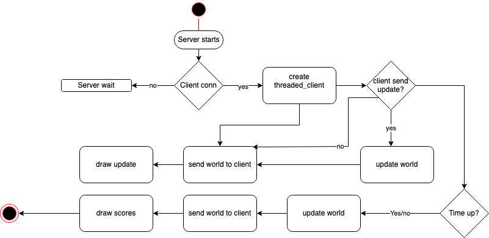

Protocol

PLEASE NOTE:
We used tcod tutorial for the roguelike game available here. http://rogueliketutorials.com/tutorials/tcod/
The class input handler is directly copied from the tutorial, the class entity is build upon the entity class from the tutorial, other functions have been developped from this base.

1. Data exchange:

   We chose to communicate with json because it's universal and easy to debug. We are sending lists in both direction. Json was well adapted for this purpose as the data is small. Our game instantiate a world object which has a list of entities, that is distributed to every connected clients (with sys.getsizeof() we got that the size of instructions is smaller than 50 bytes and the world is smaller than 4000 bytes)

   The list (the world) is in the below form:

   ```console
   {'blocked': False, 'char': '@', 'color': [23, 237, 76], 'x': 37, 'y': 11}
   {'blocked': False, 'char': '@', 'color': [55, 35, 9], 'x': 24, 'y': 7}
   {'blocked': True, 'char': 'B', 'color': [255, 255, 255], 'id': 1, 'points': 1, 'x': 13, 'y': 13}
   ```

   ### Client

   The client is instantiated with a socket, and connects to a server (in our case "localhost" and non priority-port -must be same on server and cients).

```python
    self.client_socket = socket.socket(socket.AF_INET, socket.SOCK_STREAM)
    self.client_socket.connect((SERVER, PORT))
```

Keypresses are handled by the client, saved in a list and sent to the server in json format. The dictionary are encoded in ascii.
It is impossible to crash the client by sending bad data, since it will send only keypress up-down-left-right and exit signal.

```python
if "move" in action:
    json_dump = json.dumps(action).encode('utf-8')
    self.client_socket.sendall(json_dump)

if "exit" in action:
    self.client_socket.close()
    break
```

### Server

The server has also a listening socket that receives all incoming connections. It also has a queue for operations that will be processed by the main game loop, and a list of threaded clients, to organise distribution to all connected clients.

```python
self.server_socket = socket.socket(socket.AF_INET, socket.SOCK_STREAM)
self.server_socket.bind((SERVER, PORT))
self.server_socket.listen()
self.queue = queue
```

It creates a threaded_client object (as the name explains, it is a representation of the client on the server, set in a thread). This threaded client takes the data from the actual client and put it in a list. The list is updated with the client id.
All the instructions are then put in a queue for processing by the game logic.

When the processing is done, the world list is sent to all connected clients if something has changed.

```python
def stream_game(self):
    # dumping world
    json_dump = self.world.to_json()

    for client in self.server.thread_client_list:
        # removing flagged closed clients
        if client.open == False:
            self.server.thread_client_list.remove(client)
            id_remove = client.id
            entity = self.world.get_entity(id_remove)
            self.world.entities.remove(entity)
        # sending world if different from last dump
        elif json_dump != self.last_streamed:
            client.send_processed_data(json_dump)
    # saving sent world as last dump
    self.last_streamed = json_dump
```

The transmission terminates with "\n" (ascii-10), so the client knows that the transmission is over and it can send the world for processing (drawing).

```python
msg = ""
rec_char_byte = self.client_socket.recv(1).decode("ascii")
while (rec_char_byte is not '\n'):
    msg += rec_char_byte
    rec_char_byte = self.client_socket.recv(1).decode("ascii")
decoded_retour_world = json.loads(msg)
```

2. The states:


